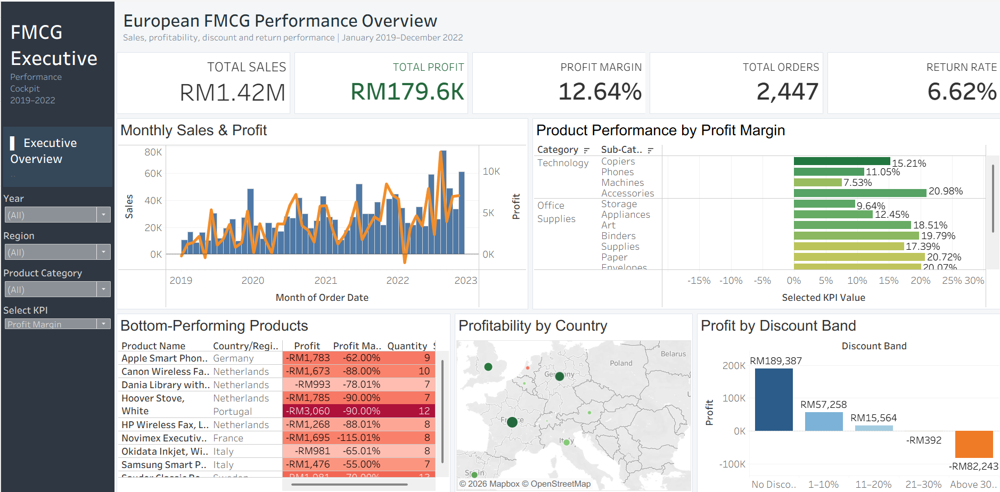

# 📊 FMCG Executive Performance Dashboard

## 📌 Project Overview

This project presents an interactive Tableau executive dashboard designed to analyse the performance of an FMCG business across sales, profitability, products, discounts, returns and geographic markets.

The dashboard consolidates key business performance indicators into a single executive view, allowing users to monitor overall performance, identify trends, compare product categories and evaluate factors affecting profitability.

The project demonstrates the use of Tableau for business intelligence, interactive dashboard development and data-driven decision making.

---

## 🛠️ Tools & Techniques

- Tableau
- Data Visualization
- Dashboard Design
- Calculated Fields
- Parameters
- KPI Development
- Geographic Analysis
- Profitability Analysis
- Discount Analysis
- Product Performance Analysis
- Data Storytelling

---

## 🎯 Business Objectives

The dashboard was developed to answer several key business questions:

- What is the overall sales and profitability performance of the business?
- How are sales and profit changing over time?
- Which product categories and sub-categories contribute most to business performance?
- Which products generate profits and which contribute to losses?
- How does discounting affect profitability?
- How does business performance vary geographically?
- What proportion of orders are returned?
- Which products require management attention?

---

# 📊 Executive Performance Dashboard



The Executive Performance Dashboard provides management with a consolidated view of the company's key business indicators.

### Key Performance Indicators

The dashboard monitors:

- Total Sales
- Total Profit
- Profit Margin
- Total Orders
- Return Rate

These KPIs provide a quick overview of the company's commercial and operational performance.

---

## 📈 Monthly Sales & Profit Trend

The monthly trend analysis compares sales and profitability over time.

This visualization enables management to identify:

- Changes in sales performance
- Profit fluctuations
- Potential seasonal patterns
- Periods where sales and profitability move differently

This is particularly useful for identifying situations where increasing sales do not necessarily translate into stronger profits.

---

## 🛍️ Category & Sub-Category Performance

The category and sub-category analysis allows users to compare performance across different areas of the product portfolio.

This helps identify:

- Strong-performing product categories
- Underperforming sub-categories
- Differences in profitability
- Areas requiring further management attention

---

## 🌍 Country Performance

A geographic visualization is used to analyse performance across different countries.

This enables users to identify geographic differences in business performance and determine which markets contribute more strongly to overall results.

---

## 💰 Discount Band Analysis

Discount levels were grouped into several bands:

- No Discount
- 1–10%
- 11–20%
- 21–30%
- Above 30%

This allows the relationship between discounting and business performance to be evaluated more clearly.

The analysis can help management determine whether higher discount levels are associated with weaker profitability and identify areas where discount strategies may require review.

---

## 📦 Product-Level Analysis

Product-level analysis allows users to investigate individual product performance and identify products that may be contributing to losses.

A Bottom N parameter is also incorporated to support dynamic identification of lower-performing products.

This enables management to focus attention on products with weaker profitability instead of analysing the entire product portfolio simultaneously.

---

# 🧮 Key Tableau Calculations

## Profit Margin

```text
SUM([Profit]) / SUM([Sales])
```

Measures the proportion of sales retained as profit.

---

## Average Order Value

```text
SUM([Sales]) / COUNTD([Order ID])
```

Measures the average sales value generated per unique order.

---

## Shipping Days

```text
DATEDIFF('day', [Order Date], [Dispatch Date])
```

Calculates the number of days between an order being placed and dispatched.

---

## Discount Band

```text
IF [Discount] = 0 THEN "No Discount"
ELSEIF [Discount] <= 0.10 THEN "1–10%"
ELSEIF [Discount] <= 0.20 THEN "11–20%"
ELSEIF [Discount] <= 0.30 THEN "21–30%"
ELSE "Above 30%"
END
```

Groups individual discount values into meaningful ranges for analysis.

---

## Profit Status

```text
IF SUM([Profit]) < 0 THEN "Loss"
ELSE "Profit"
END
```

Classifies performance according to whether the aggregated profit is positive or negative.

---

## Returned Orders

```text
COUNTD(
    IF [Returned] = "Yes"
    THEN [Order ID]
    END
)
```

Calculates the number of unique orders recorded as returned.

---

## Return Rate

```text
[Returned Orders] / COUNTD([Order ID])
```

Measures returned orders as a proportion of total unique orders.

---

## Loss Severity

```text
IF SUM([Profit]) < 0 THEN
    ABS(SUM([Profit]))
ELSE
    0
END
```

Quantifies the magnitude of losses generated by unprofitable areas.

---

## 🎛️ Interactive Features

The dashboard incorporates interactive functionality to support more flexible analysis.

### KPI Selection

A parameter allows different performance measures to be selected, including:

- Sales
- Profit
- Profit Margin
- Quantity

### Bottom N Product Analysis

A dynamic parameter allows users to control the number of lower-performing products displayed.

These features allow the dashboard to adapt to different management questions without requiring separate visualizations.

---

## ⚙️ Analytical Workflow

The project followed a business intelligence workflow:

1. Reviewed and prepared the FMCG dataset.
2. Identified key business performance indicators.
3. Created calculated fields for profitability, returns, discounts and operational performance.
4. Developed individual Tableau worksheets for different analytical areas.
5. Added parameters to support interactive analysis.
6. Integrated the worksheets into an executive-level dashboard.
7. Designed the dashboard to support rapid identification of performance trends and potential business issues.

---

## 💡 Business Applications

The dashboard can support management in:

- Monitoring overall sales and profitability
- Identifying underperforming products
- Evaluating category and sub-category performance
- Reviewing discount strategies
- Monitoring product returns
- Comparing geographic market performance
- Identifying sales and profit trends
- Supporting data-driven business decisions

---

## 🚀 Skills Demonstrated

- Tableau Dashboard Development
- Business Intelligence
- KPI Design
- Calculated Fields
- Parameters
- Profitability Analysis
- Discount Analysis
- Product Performance Analysis
- Geographic Visualization
- Trend Analysis
- Data Visualization
- Business Data Storytelling

---

## 📚 What I Learned

This project strengthened my ability to design an executive-level Tableau dashboard that combines multiple areas of business performance into a single analytical view.

It also improved my understanding of calculated fields, parameters, KPI design and interactive dashboard development while strengthening my ability to translate business data into information that can support management decision making.

---

## 👤 Author

**Paul Lim Yi Xuan**

Final-Year Business Analytics Student
